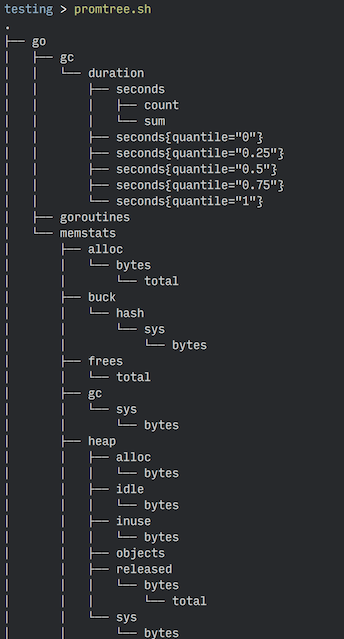

# `promtree`

a quick and dirty `tree` for prometheus services

## Usage

    promtop.sh localhost/metrics
    
## How Rough Is This?

Well, it's pretty rough.

To get the tree shown above, it:

1. Gets all the metrics
2. Filters out the comments
3. Replaces `_` with `/`
4. Writes those "directories" to a tempdir
5. Runs `tree` on the tempdir
6. Deletes the tempdir

So you probably don't want to do anything serious with this. It's a pretty hacky hack, as hacks go.
